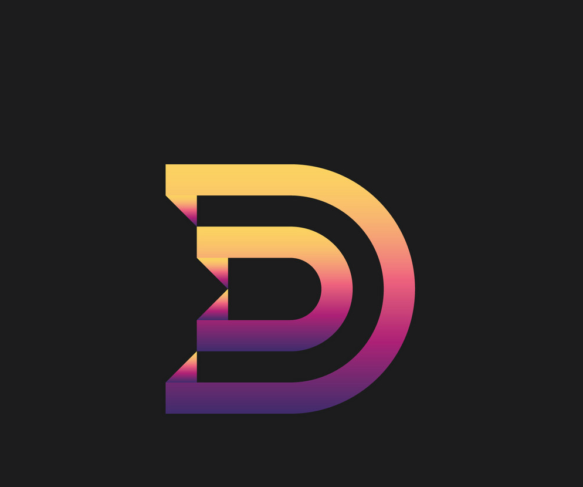

# dynut
- An Unix Based Operating System Built Using C++

</img>

## Building:
- want to try out dynutOS??
- see the build [instructions](https://github.com/dynutOS/dynut/blob/main/Docs/building.md)
